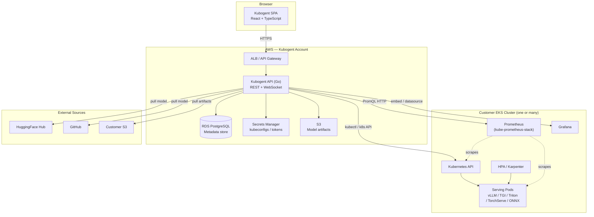
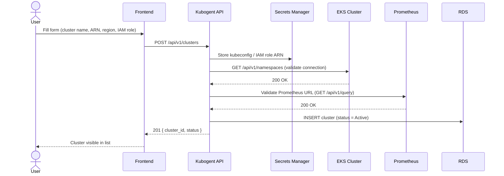
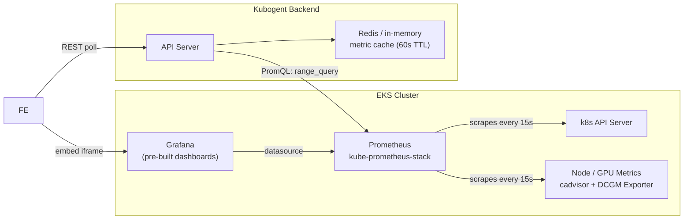
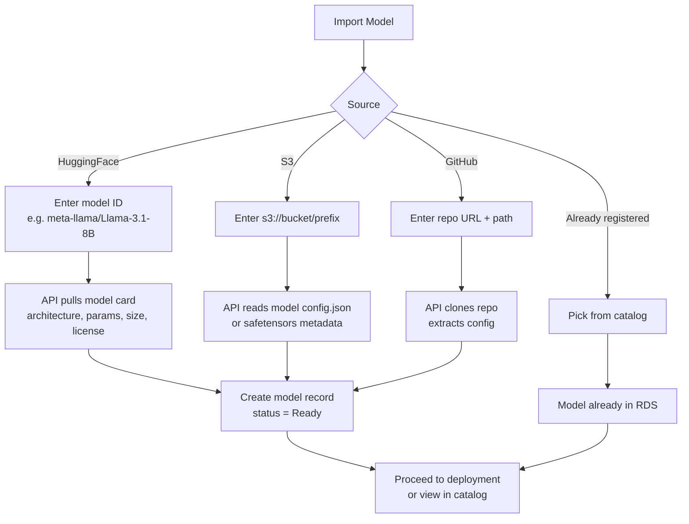
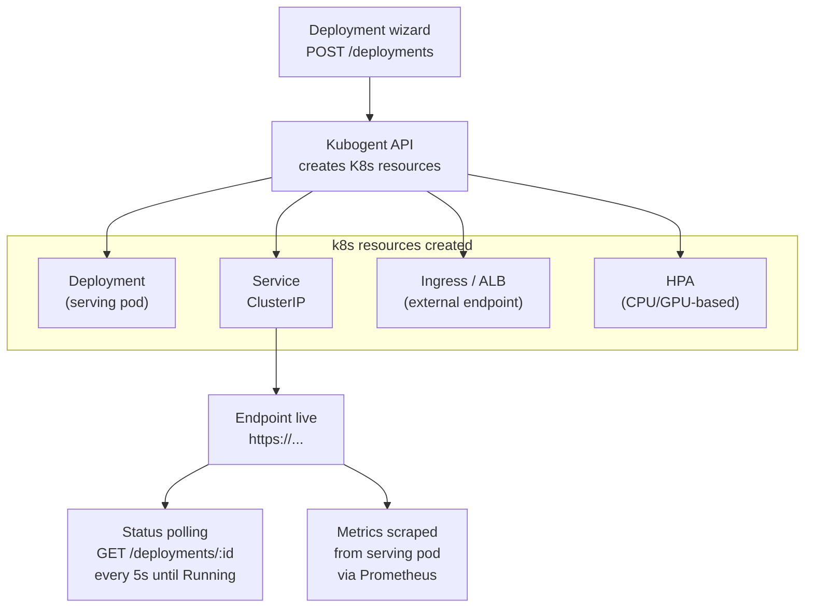
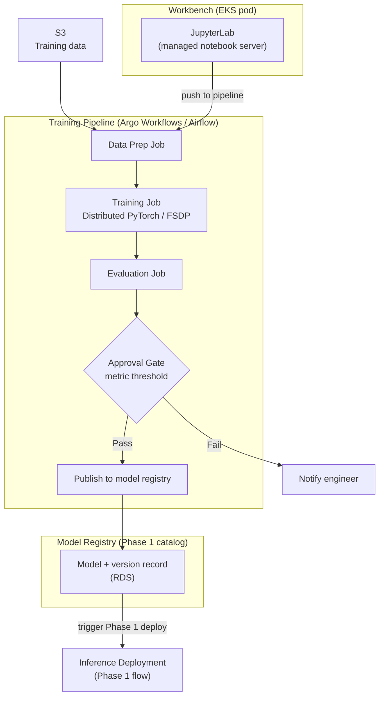

# Kubogent — Product Specification

**Version:** 1.0  
**Status:** Draft for engineering review  
**Stack:** React + TypeScript (frontend) · Go API (REST + WebSocket) · RDS PostgreSQL · AWS EKS

---

## 1. What is Kubogent?

Kubogent is an MLOps control plane for teams running AI workloads on AWS EKS. It provides a single UI to manage Kubernetes clusters, deploy and monitor inference endpoints, and (later) run training and fine-tuning pipelines.

**Design principles**
- Platform engineers and ML engineers share one interface — no context-switching between tools
- The UI surfaces observability data that already exists (Prometheus, Grafana, k8s API) rather than re-implementing it
- Every action has a corresponding API — the UI is a client, not a special case

---

## 2. Overall System Architecture



**Auth flow**
- User → Kubogent API: JWT (Amazon Cognito or self-hosted issuer)
- Kubogent API → EKS: IAM role assumption (`sts:AssumeRole`) + kubeconfig stored in Secrets Manager
- Kubogent API → S3/ECR: IAM instance role with least-privilege policy
- HuggingFace / GitHub tokens: stored per-user in Secrets Manager

---

## 3. Phase 1 — Cluster Management & Inference Deployment

**Timeline:** 3–5 weeks  
**Goal:** A team can register their EKS cluster, inspect it deeply, and ship an inference endpoint — all from one UI.

### 3.1 Feature Scope

| Area | In scope | Out of scope |
|---|---|---|
| Clusters | Register, list, view detail, delete | Create new EKS cluster from scratch |
| Observability | Prometheus metrics, Grafana dashboard embed | Custom alert rules, PagerDuty |
| Terminal | kubectl exec via WebSocket, namespace selector | Multi-cluster session, file upload |
| Model catalog | Import from HF Hub / S3 / GitHub, list, view detail, version history | Model training, fine-tuning |
| Inference | Deployment wizard, endpoint management, metrics, logs, scaling history | Training pipelines, A/B deployments |
| Auth | JWT + IAM | RBAC per resource (Phase 2+) |

---

### 3.2 Cluster Management

#### Registration flow



#### Cluster detail — tabs

| Tab | Content |
|---|---|
| Overview | Node count, GPU count, k8s version, region, VPC, cost/hr, node group summary |
| Node Groups | Table: name, instance type, status, desired/min/max, GPU type, GPU/node |
| GPU Utilization | Bar chart: VRAM used vs total per GPU; 4-up GPU cards with % |
| Monitoring | Grafana dashboard iframe (configurable dashboard URL) + raw Prometheus metric cards |
| Logs & Events | k8s events stream, filterable by namespace/severity |
| Networking | VPC, subnets, security groups, endpoint access config |
| Security | Pod security admission, IMDSv2, audit logging, encryption, network policies |
| Autoscaling | Karpenter provisioner config + YAML view |
| Terminal | kubectl WebSocket terminal with namespace selector (Go — `gorilla/websocket` + `client-go`) |

#### Observability architecture



**Terminal implementation:** Go — `gorilla/websocket` for the WebSocket upgrade; `k8s.io/client-go` for pod exec (`/exec` subresource). The API server proxies stdin/stdout/stderr between browser and the container's shell. Each session is scoped to a cluster+namespace and authenticated via the user's JWT.

**GPU metrics scraped via:** DCGM Exporter (`nvidia/dcgm-exporter`) — standard on GPU node groups.  
**Required Prometheus rules:** `kube-prometheus-stack` Helm chart; no custom rules needed for Phase 1.

---

### 3.3 Model Catalog

#### Import flow



**Model categories supported:** LLM · SLM · Code · Embedding · STT · TTS · Vision · Object Detection · Diffusion · Traditional ML

---

### 3.4 Inference Deployment

#### Deployment wizard — steps

| Step | Fields |
|---|---|
| 1. Model | Select from catalog or import inline |
| 2. Engine | vLLM · TGI · Triton · TorchServe · ONNX Runtime · llama.cpp |
| 3. Engine config | Replicas, GPU count, quantization (FP16/INT8/INT4), context length, max batch size, tensor parallel size |
| 4. Cluster | Select registered cluster + namespace |
| 5. Review | Summary + estimated cost/hr → Deploy |

#### Deployment flow



**Serving pod templates:** Kubogent maintains a Helm chart / k8s manifest template per serving framework. Engine config fields map to container args.

| Framework | Best for | Key args |
|---|---|---|
| vLLM | LLM (latency) | `--dtype`, `--tensor-parallel-size`, `--gpu-memory-utilization` |
| TGI | LLM (HF-native) | `--quantize`, `--max-input-length`, `--max-batch-prefill-tokens` |
| Triton | Vision / multi-model | model repository, backend config |
| TorchServe | General PyTorch | `--workers`, `--batch-size` |
| ONNX Runtime | Cross-platform | execution provider (CUDA/CPU) |
| llama.cpp | CPU-friendly LLM | `--n-gpu-layers`, `--ctx-size` |

#### Deployment detail — tabs

| Tab | Content |
|---|---|
| Metrics | TTFT, throughput (tok/s), success rate, GPU memory — time-series charts |
| Lineage | Model version, source, training run (if applicable) |
| Logs | Live log stream from serving pod |
| Scaling History | HPA events: scale up/down, reason, replica count |

---

### 3.5 Data Model

#### RDS PostgreSQL — Phase 1 tables

```
clusters
  id              UUID PK
  name            TEXT
  arn             TEXT
  region          TEXT
  k8s_version     TEXT
  status          TEXT  (Active | Inactive | Error)
  prometheus_url  TEXT
  grafana_url     TEXT
  iam_role_arn    TEXT
  secret_arn      TEXT  → Secrets Manager
  cost_per_hour   DECIMAL
  created_at      TIMESTAMPTZ
  updated_at      TIMESTAMPTZ

node_groups
  id              UUID PK
  cluster_id      UUID FK → clusters
  name            TEXT
  instance_type   TEXT
  desired_count   INT
  min_count       INT
  max_count       INT
  gpu_type        TEXT
  gpu_per_node    INT
  status          TEXT

models
  id              UUID PK
  name            TEXT
  source          TEXT  (huggingface | s3 | github | uploaded)
  category        TEXT  (llm | slm | code | embedding | stt | tts | vision | ...)
  architecture    TEXT
  parameters      TEXT  (e.g. "8B")
  size_gb         DECIMAL
  hf_model_id     TEXT
  s3_uri          TEXT
  github_repo     TEXT
  license         TEXT
  status          TEXT  (Ready | Importing | Error)
  created_at      TIMESTAMPTZ

model_versions
  id              UUID PK
  model_id        UUID FK → models
  version         TEXT
  s3_path         TEXT
  source_ref      TEXT
  created_at      TIMESTAMPTZ

deployments
  id              UUID PK
  model_id        UUID FK → models
  model_version_id UUID FK → model_versions
  cluster_id      UUID FK → clusters
  namespace       TEXT
  serving_framework TEXT
  engine_config   JSONB  (replicas, gpu_count, quantization, ...)
  status          TEXT  (Deploying | Running | Stopped | Failed)
  endpoint_url    TEXT
  replicas        INT
  created_at      TIMESTAMPTZ
  updated_at      TIMESTAMPTZ
```

---

### 3.6 API Reference

All endpoints are prefixed `/api/v1`. Auth: `Authorization: Bearer <jwt>`.

#### Clusters

```
GET    /clusters                     List all clusters
POST   /clusters                     Register a cluster
GET    /clusters/:id                 Cluster detail
DELETE /clusters/:id                 Deregister cluster
GET    /clusters/:id/nodes           Node group list
GET    /clusters/:id/metrics         Prometheus metrics (query param: metric, range)
GET    /clusters/:id/namespaces      List k8s namespaces
WS     /clusters/:id/terminal        kubectl WebSocket session
```

#### Models

```
GET    /models                       List models (filter: category, status)
POST   /models/import                Import from HF / S3 / GitHub
GET    /models/:id                   Model detail
DELETE /models/:id                   Remove from catalog
GET    /models/:id/versions          Version history
POST   /models/:id/versions          Register new version
```

#### Deployments

```
GET    /deployments                  List deployments (filter: status, cluster, model)
POST   /deployments                  Create deployment (triggers k8s apply)
GET    /deployments/:id              Deployment detail + status
DELETE /deployments/:id              Undeploy (deletes k8s resources)
GET    /deployments/:id/metrics      Time-series metrics from Prometheus
GET    /deployments/:id/logs         Log stream (SSE)
POST   /deployments/:id/scale        Update replica count
```

---

### 3.7 Week-by-Week Timeline

| Week | Backend | Frontend |
|---|---|---|
| 1 | Project scaffold, RDS migrations, cluster registration API, Secrets Manager integration | App shell, auth (Cognito), cluster list + add cluster form |
| 2 | Prometheus query layer, k8s metrics API, WebSocket terminal | Cluster detail page: Overview + Node Groups + GPU + Terminal tabs |
| 3 | Model import workers (HF, S3, GitHub), model CRUD API, model version tracking | Model catalog page, import modal, model detail page |
| 4 | Serving framework deployer (k8s manifest templates per engine), deployment CRUD, status polling, metrics scraping | Deployment wizard (5 steps), deployment detail page (Metrics, Logs, Scaling) |
| 5 | Integration testing, error handling, endpoint health checks, API hardening | Grafana iframe embed, polish, E2E tests, staging deploy |

**Team of 3–4:** backend and frontend work in parallel from week 2. One engineer owns DevOps/infra (Terraform, IAM, Helm charts) throughout.

---

## 4. Phase 2 — ML Engineering & Training Pipelines

> **Not scheduled.** Spec to be detailed when Phase 1 ships.

### 4.1 Scope

| Area | Description |
|---|---|
| Workbench | JupyterLab provisioned as a pod on a selected EKS cluster; managed via Kubogent UI |
| Experiments | MLflow-compatible experiment tracking; run comparison, metric charts |
| Training pipelines | DAG-based pipelines: data prep → training → evaluation → approval gate → deploy |
| Fine-tuning | LoRA / QLoRA / full fine-tune with dataset upload from S3 |
| Model publishing | Publish trained weights to S3 or GitHub from notebook |
| Optimization | Serving strategy advisor (quantization, export format, code snippet generation) |

### 4.2 Architecture Preview



### 4.3 Additional RDS tables (Phase 2)

```
notebook_servers       (id, cluster_id, image, gpu_config, status, url, ...)
pipeline_definitions   (id, name, stages JSONB, trigger, scheduler, ...)
pipeline_runs          (id, pipeline_id, status, started_at, finished_at, ...)
pipeline_stages        (id, run_id, type, status, metrics JSONB, artifacts JSONB, ...)
experiment_runs        (id, notebook_id, model_id, hyperparams JSONB, metrics JSONB, ...)
```

---

## 5. Appendix A — Serving Framework Matrix

| Framework | LLM | Vision | Audio | CPU support | HF-native | Streaming |
|---|---|---|---|---|---|---|
| vLLM | ✅ Best | ❌ | ❌ | ❌ | ✅ | ✅ |
| TGI | ✅ Good | ❌ | ❌ | ✅ limited | ✅ | ✅ |
| Triton | ✅ | ✅ Best | ✅ | ✅ | ❌ | ❌ |
| TorchServe | ✅ | ✅ | ✅ | ✅ | ❌ | ❌ |
| ONNX Runtime | ✅ | ✅ | ✅ Best | ✅ Best | ❌ | ❌ |
| llama.cpp | ✅ CPU-best | ❌ | ❌ | ✅ Best | ❌ | ✅ |

---

## 6. Appendix B — Engine × Model Category Defaults

| Category | Recommended engine | Fallback |
|---|---|---|
| LLM (7B–70B) | vLLM | TGI |
| SLM (< 3B) | vLLM · llama.cpp | ONNX Runtime |
| Code | vLLM | TGI |
| Embedding | ONNX Runtime | TorchServe |
| STT | ONNX Runtime | Triton |
| TTS | ONNX Runtime | Triton |
| Vision / Diffusion | Triton | TorchServe |
| Object Detection | Triton | ONNX Runtime |
| Traditional ML | ONNX Runtime | TorchServe |

---

## 7. Appendix C — Infrastructure Requirements

### Kubogent service (runs in its own AWS account / VPC)

| Component | Service | Notes |
|---|---|---|
| API server | ECS Fargate or EKS | Go binary — stateless, horizontally scalable |
| Database | RDS PostgreSQL 15 | Multi-AZ for production |
| Secrets | AWS Secrets Manager | One secret per cluster kubeconfig / token |
| File store | S3 | Model artifacts, import staging |
| Auth | Amazon Cognito | JWT issuer; SAML/OIDC federation optional |
| Load balancer | ALB | HTTPS termination, WAF optional |
| WebSocket | ALB (sticky sessions) | For kubectl terminal |

### Per-customer EKS cluster (prerequisites)

| Component | Requirement |
|---|---|
| IAM role | Cross-account role with `eks:DescribeCluster`, `eks:ListNodegroups`, `ec2:Describe*` |
| Prometheus | `kube-prometheus-stack` Helm chart installed |
| DCGM Exporter | Required for GPU metrics (`nvidia/dcgm-exporter`) |
| Grafana | Optional; Kubogent can embed existing Grafana or use its own |
| Ingress | ALB Ingress Controller (for serving endpoints) |
| Karpenter | Optional; Kubogent reads provisioner config if present |
